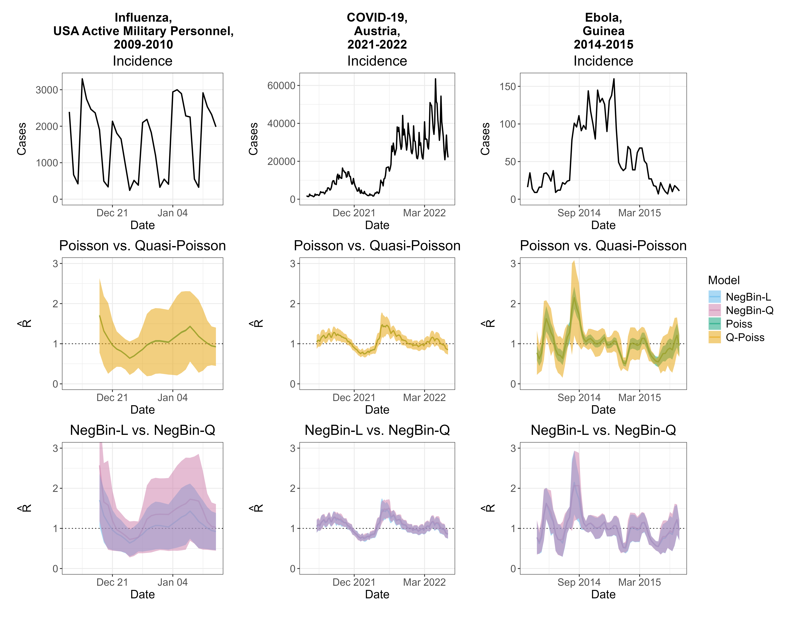

*This blog post is based on a [preprint](https://www.medrxiv.org/content/10.1101/2025.07.31.25332479v2) we recently posted, summarizing the main message. The figure used here is ours.*

## The problem of overconfidence in the Poisson renewal equation method

Estimating the effective reproductive number, $R_t$, is often done using methods based on the Poisson renewal equation, which makes use of the recent incidence data. A part of the appeal of the renewal equation approach is that it is simple to understand and apply in practice. However, the underlying Poisson assumption enforces equidispersion and therefore cannot handle the overdispersion, commonly observed in infectious disease data. As a result, the method often issues too narrow confidence intervals for the $R_t$ estimates. A highly popular implementation, the [`EpiEstim`](https://mrc-ide.github.io/EpiEstim/index.html) package by @Cori2013, is notably affected by this issue, as are several related $R_t$ estimation tools, including [`EpiInvert`](https://cran.r-project.org/web/packages/EpiInvert/index.html), [`ern`](https://journals.plos.org/plosone/article?id=10.1371/journal.pone.0305550), [`estimateR`](https://covid-19-re.github.io/estimateR/articles/estimateR.html) and [`Rtglm`](https://www.sciencedirect.com/science/article/pii/S1755436525000453). While this limitation has been pointed out empirically on several occasions [@Goldstein2023; @Brockhaus2023], we summarise it concisely in our [preprint](https://www.medrxiv.org/content/10.1101/2025.07.31.25332479v2) to bring it to the attention of the community.

## The renewal equation and the Poisson assumption

The Poisson renewal equation can be expressed as:

$$
\begin{split}
  X_t \mid \text{Past} & \sim \text{Pois}(\mu_t),\ t = 1, \dots, T \\
  \mu_t & = R\times \Lambda_t,\\
  \Lambda_t & = \sum_{d = 1}^D w_d \times X_{t - d}.
\end{split}
$$

Here, $X_t$ denotes the incidence at time $t$, and $w_1, \, \dots, \,w_D$ represents the discrete-time serial interval distribution. The reproductive number $R$ is assumed constant over an estimation window of width $T$ days (which is why we omit the index $_t$). If we denote the conditional variance $\text{Var}(X_t\mid \text{Past})$ as $\sigma^2_t$, then the Poisson distribution implies equidispersion: $\sigma^2_t = \mu_t$. In practice, however, we often observe overdispersion, where $\sigma^2_t > \mu_t$. In this case, applying a Poisson model leads to incorrect quantification of the estimation uncertainty.

The renewal equation can be interpreted as a Poisson regression model with an identity link, no intercept, and a single covariate $\Lambda_t$. We can therefore use [standard GLM theory](https://link.springer.com/book/10.1007/978-3-642-34333-9) to study its properties. Under a frequentist approach, we can calculate the maximum likelihood estimate of $R$ as

$$
\hat{R}_{\text{Po}} = \frac{\sum_{t = 1}^T X_t}{\sum_{t = 1}^T \Lambda_t},
$$
while the standard error of $\hat{R}_{\text{Po}}$ based on the Poisson assumption is

$$
\widehat{\text{se}}(\hat{R}_\text{Po}) = \frac{\hat{R}_\text{Po}}{\sqrt{\sum_{t = 1}^T X_t}}.
$$
The standard error of the estimate thus depends only on the magnitude of the incidence, not on its variability or "noisiness". Arguments from [quasi-Poisson regression](https://link.springer.com/chapter/10.1007/978-3-642-34333-9_5) imply that if overdispersion is present, the above expression will underestimate the true standard error of $\hat{R}_{\text{Po}}$ by a factor of $\sqrt{\phi}$, with

$$
\phi = \frac{\sum_{t = 1}^T \sigma^2_t}{\sum_{t = 1}^T \mu_t}.
$$

## Illustrative case studies

We can use the regression model formulation of the renewal equation model to relax the equidispersion assumption. One option is to use quasi-Poisson regression instead of Poisson, which yields identical point estimates, but allows for overdispersion. Another possible approach is to replace the Poisson distribution with a negative binomial distribution. In this paper we used two different parametrizations, which we call *NegBin-L* and *NegBin-Q*. In our naming convention, *L* stands for the *linear* mean-variance relationship, while *Q* indicates a quadratic mean-variance relationship.

To compare estimates from the Poisson model with those from models that account for overdispersion, we selected three datasets corresponding to different pathogens and locations where the Poisson renewal equation, specifically the `EpiEstim` method, was used in the past -- Influenza among the active U.S. military personnel [@Nash2023], COVID-19 in Austria [@Richter2022] and Ebola in Guinea [@Green2022].

As shown in the second row of the figure, for Influenza and COVID-19, the Poisson confidence intervals (green) were visually indistinguishable from the point estimates, while the quasi-Poisson intervals (orange) are much wider. This is the consequence of the formula for $\widehat{\text{se}}(\hat{R}_\text{Po})$, which in the Poisson case is dominated by large incidence values in the denominator. For Ebola, the Poisson intervals are wider. However, they rarely include $R = 1.0$, implying high confidence about epidemic growth or decline and the quasi-Poisson model is still more uncertain. Comparing the negative binomial models, we can notice some disagreement in point estimates and the confidence interval widths for the Influenza example, which is caused by strong weekday effects. Nonetheless, in all examples, confidence intervals are much wider than those from the Poisson model. In the paper we also conduct a simulation study, which shows that all three models accounting for overdispersion (quasi-Poisson, NegBin-L, and NegBin-Q) work reasonably well, and that it is not crucial whether the mean variance relationship is specified correctly, unless inference about the disease dynamics is required.

## The key takeaway

In the paper, we demonstrate that $R_t$ estimates based on the Poisson renewal equation are overconfident in presence of overdispersion; i.e., the associated uncertainty intervals are too narrow. We formulate the renewal equation model as a GLM to derive, by how much the uncertainty is underestimated. This effect can be very pronounced in practice. Therefore, we do not recommend relying on the Poisson renewal equation model to assess the uncertainty of $R_t$ estimates. Consequently, we discourage using the current form of `EpiEstim` and the related R packages discussed above for interval estimation. Alternative tools like [`EpiNow2`](https://cran.r-project.org/web/packages/EpiNow2/index.html) [@Abbott2020] and [`EpiLPS`](https://cran.r-project.org/web/packages/EpiLPS/index.html) [@Gressani2022] that account for overdispersion are favorable for the uncertainty quantification, even though their added complexity may present a challenge for some users.
